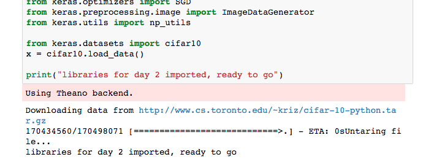

# Advanced Machine Learning Techniques with Python Setup Instructions

## A word about the setup

We offer below a detailed setup. Please bear in mind that we have run this workshop multiple times and the setup below works "most of the time". If your computer is being really stubborn, please send us an email with a screenshot of what you're confronted with and we will see how we can help you.

Note that most of the requirements are for the second day (apart from Anaconda) so that if you have an issue with `opencv` (quite common), we should be able to help you on the day. Please do make sure to download the data as it is quite sizeable and would take a long time to download if you all do it simultaneously on the Saturday!

**Step 0** = go make yourself a tea or a coffee (or a Gin and Tonic, whatever floats your boat), unless you're already an expert with installing packages etc, the following set of instructions is likely to take you a good half an hour.

### What will you install

* **Anaconda**: a tool that installs many, very useful, Python packages for scientific programming.
* **Plotly**: a tool for interactive visualisation.
* **Keras**: a package to deal with Neural Networks (needed for the second day).
* **Theano**: one of the tool Keras can use to compute things efficiently.

you will also download a big dataset we will use on the second day.

If you already have those tools installed, please go to the end of these instructions and execute the notebook that all those libraries can indeed be imported without problem. 

<!-- ## Quick setup

If you are already familiar with programming, packages etc., here are the basic steps to complete. If you are not so familiar with programming (or encounter a problem), see below for the detailed steps. If any of those steps seems strange and or fails, please head to the detailed instructions.

### The packages

* Install Anaconda (prefer **Python 2.7**) from: [https://www.continuum.io/downloads](https://www.continuum.io/downloads)
* Using `pip`, install Plotly, keras, Theano:

```bash
(sudo) pip install Plotly, keras
(sudo) pip install --upgrade --no-deps git+git://github.com/Theano/Theano.git
```

If on Windows, please do:

```bash
(sudo) conda install mingw libpython
```

OpenCV is required for the Deep Learning part, if you're on Python 3+ the first line will not work, so please execute the second.

```bash
(sudo) conda install opencv # ON PYTHON 2.7 (recommended)
(sudo) conda install --channel https://conda.anaconda.org/menpo opencv3 # PYTHON 3+
```

Now you need to setup keras so that it runs with Theano. For this you need to first generate the configuration file by trying to import keras once (it will fail, that's fine).

```bash
python -c "import keras" # this will spit an error, ignore it
```

This generates a file `./keras/keras.json` which you need to edit replacing `tf` by `th` and `tensorflow` by `theano`, the following command does that for you:

```bash
sed -i '' -e 's/tf/th/' -e 's/tensorflow/theano/' ~/.keras/keras.json
```

Lastly, download the following file and place it in the day2 folder

VGG16 weights (500MB) from [https://drive.google.com/file/d/0Bz7KyqmuGsilT0J5dmRCM0ROVHc/view](https://drive.google.com/file/d/0Bz7KyqmuGsilT0J5dmRCM0ROVHc/view)

Clone our repository:

```bash
git clone https://github.com/cambridgecoding/machinelearningbootcamp.git
``` -->

## Detailed Instructions

### Install Anaconda

Install Anaconda (we recommend taking the version for **Python 2.7**) from:  [https://www.continuum.io/downloads](https://www.continuum.io/downloads)
This includes python 2.7.9 and the necessary libraries we will be using such as `numpy`, `scipy` and `scikit-learn`. Check that everything is properly set up by going to your Terminal/Command Line and typing

```bash
python -V
```

which should return something like `Python 2.7.12 :: Anaconda 4.2.0`.

**Remark**: if it does not return this (this may happen if you're a Windows user), open the program **Anaconda-Navigator**, you will be able to install the packages mentioned below via that application. For this, click on  "Environments" then click on the drop-down menu at the top that says "Installed" and select "Not Installed", then type the name of the packages mentioned below in the search bar and install them.

### Install Packages with pip

In your terminal/command line you should now be able to use `pip` which will allow you to install packages we need. If you have an issue with `pip` (e.g., if your terminal tells you it doesn't know that command), see the remark at the point above (*using Anaconda-Navigator*) or check the link: [https://pip.pypa.io/en/latest/installing/](https://pip.pypa.io/en/latest/installing/) (If installing via the terminal/command line, ensure you are in the directory where you have downloaded the file `get-pip` or if using chrome right-click on the link to download, save to desktop, and simply double click on the executable).

You may need to use `sudo pip install` (for OSX, *nix, etc) or run your command shell as Administrator (for Windows) to be able to perform the installation of the following individual packages. Try copy pasting the following lines in your terminal without the `(sudo)`, if it fails, add `sudo`, you will be asked to enter your user password.

```bash
(sudo) pip install Plotly
(sudo) pip install keras
(sudo) pip install --upgrade --no-deps git+git://github.com/Theano/Theano.git
```

If you're on Windows you'll need to install some additional packages to use Theano:

```bash
(sudo) conda install mingw libpython
```

If you already have any of the previously-mentioned libraries installed, you can (should) update them to the latest available version using the syntax:

```bash
(sudo) pip install <package> --upgrade
```

where `<package>` can be any of the aforementioned libraries.

### Install additional required packages with conda

Again, go to your terminal and execute

```bash
(sudo) conda install opencv
```

If the opencv/cv2 library does not load or the previous step gives you an error, you may want to try this newer version:

```bash
(sudo) conda install -c https://conda.binstar.org/menpo opencv
```

If you want to install opencv (including cv2) on OSX with **Python 3+** (not 2.7) try this:

```
(sudo) conda install --channel https://conda.anaconda.org/menpo opencv3
```

and in your code, you will need to add `import cv2` at the beginning.

## Setting up keras

You will need to configure the **Keras** package to work with Theano. In your terminal run:

```bash
python -c "import keras"
```

This will probably return an error about "TensorFlow" not being available. Don't worry. It will also generate a configuration file which you can modify to specify that you want to use Theano instead of TensorFlow as a backend. A quick way to do this modification is to execute the following line:

```bash
sed -i '' -e 's/tf/th/' -e 's/tensorflow/theano/' ~/.keras/keras.json
```

If you'd like to do it manually, open the file `~/.keras/keras.json` (note that it starts by `.` so that it will be a hidden file which may not appear expliclty when you browse your home folder). Open the file using a text editor, it should look like this:

```json
{
    "image_dim_ordering": "tf",
    "epsilon": 1e-07,
    "floatx": "float32",
    "backend": "tensorflow"
}
```

Replace `tf` with `th` and `tensorflow` with `theano` so that it looks like

```json
{
    "image_dim_ordering": "th",
    "epsilon": 1e-07,
    "floatx": "float32",
    "backend": "theano"
}
```

### Download the data (this may take some time!)

Download the following file and place it in the day2 folder

VGG16 weights (500MB) from [https://drive.google.com/file/d/0Bz7KyqmuGsilT0J5dmRCM0ROVHc/view](https://drive.google.com/file/d/0Bz7KyqmuGsilT0J5dmRCM0ROVHc/view)

### Install git and sign up on GitHub (optional)

**This step is only required if you are using "git clone" and not "download" in the next step**

Check if you have git by typing `git --version` in your terminal if it returns an error (`command not found`), you can install it: [http://git-scm.com/](http://git-scm.com/)

Sign up for a GitHub account or sign in if you have one: [github.com](https://github.com)

### Clone or download the code from the CCA GitHub repository

You can create a copy of the provided code on your local machine by using the "git clone" command on your console:

```bash
git clone https://github.com/cambridgecoding/machinelearningbootcamp.git
```

Alternatively, click on the "Download ZIP" button under [https://github.com/cambridgecoding/machinelearningbootcamp](https://github.com/cambridgecoding/machinelearningbootcamp)

### Finalise the setup

Navigate to the cloned `machinelearningbootcamp` repository on your local machine, open and run the "[load_libraries.ipynb](https://github.com/cambridgecoding/machinelearningbootcamp/blob/master/load_libraries.ipynb)" file. To execute the notebook, in your terminal run:

```
ipython notebook load_libraries.ipynb
```

Wait for the pre-fetching of the CIFAR10 dataset to be completed (it may take a while but a progress bar will show you the remaining time) and check whether the libraries have been successfully loaded.

* You can run the notebook document step-by-step (one cell a time) by pressing **shift + enter**.
* You can run the whole notebook in a single step by clicking on the menu Cell -> Run All.
* To restart the kernel (i.e. the computational engine), click on the menu Kernel -> Restart. This can be useful to start over a computation from scratch (e.g. variables are deleted, open files are closed, etc...).
* Click on the menu Help -> User Interface Tour for an overview of the Jupyter Notebook App user interface.

**Remark 1**: if from earlier you had issues with using the terminal, you can also use the "Anaconda Navigator" to try to open and run this ipython notebook.

**Remark 2**: this file essentially verifies that you can load all the libraries appropriately. If that's the case you should see:

```
libraries for day 1 imported, ready to go
```

and, further down



If you do not see that and see something that looks awful, something went wrong in the setup. Please look at the end of the error message to try to identify where it came from. If you have no idea, please send us a screenshot of the error message and we'll try to figure out what's going on!
